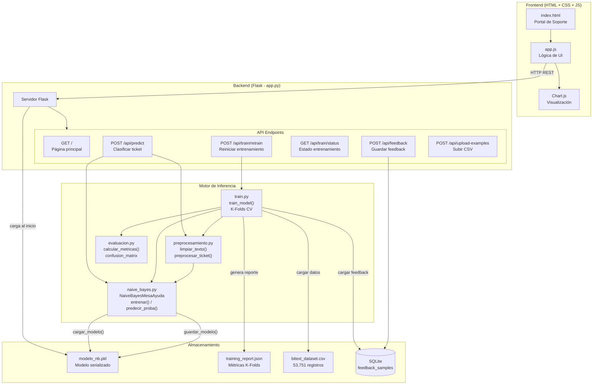
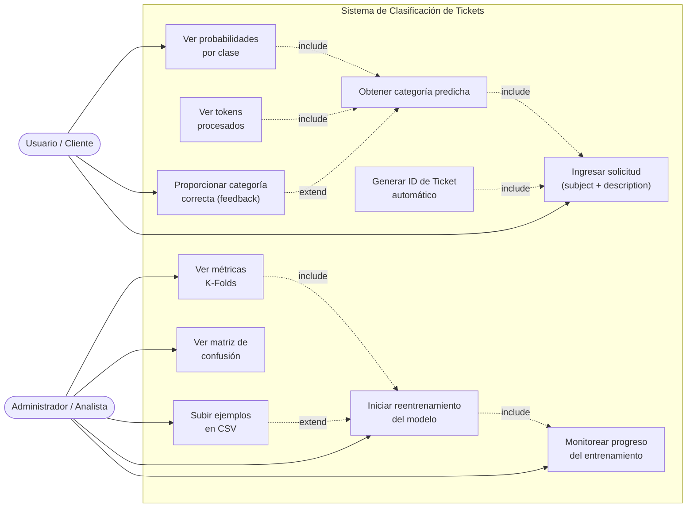
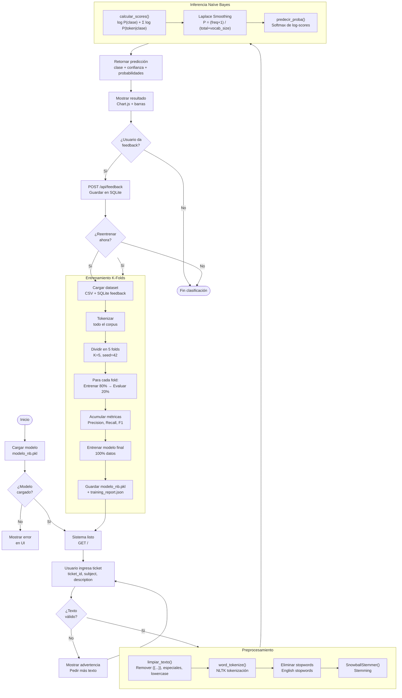
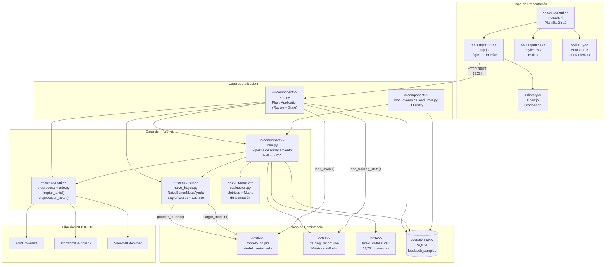

# Diagramas del Sistema — Clasificación de Solicitudes a Mesa de Ayuda

## 1. Arquitectura de la Solución

---

## 2. Diagrama de Casos de Uso

---

## 3. Diagrama de Flujo General

---

## 4. Diagrama de Componentes

